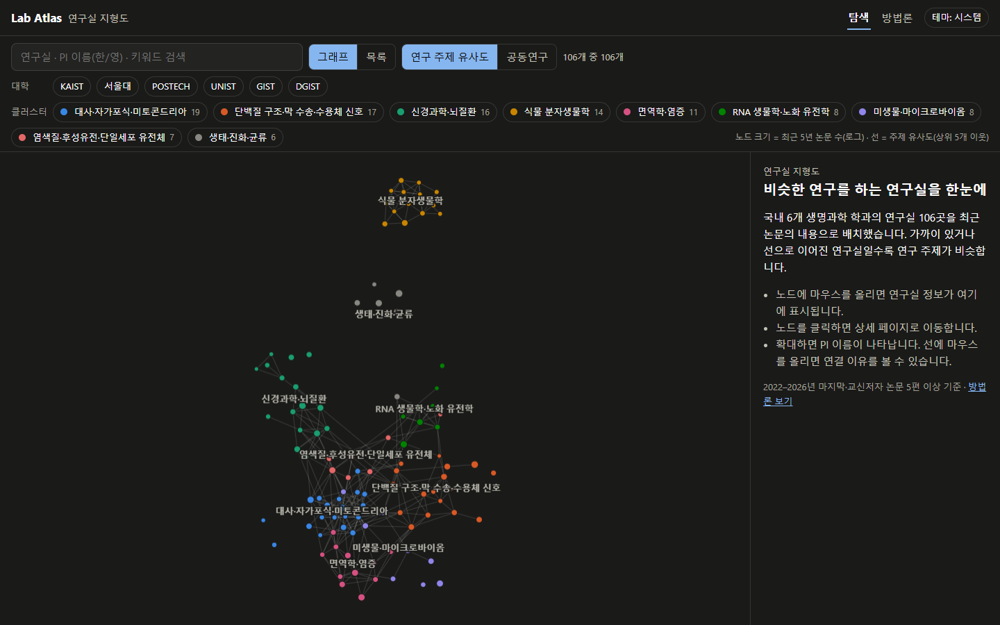
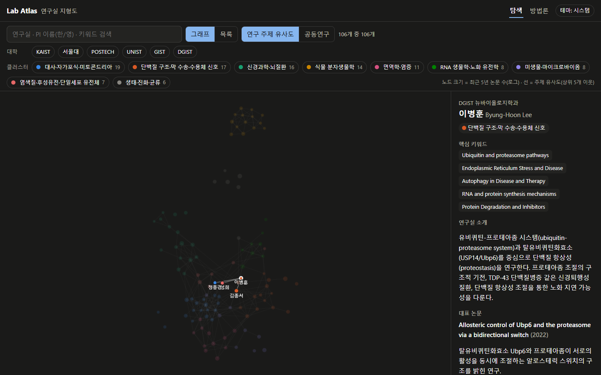
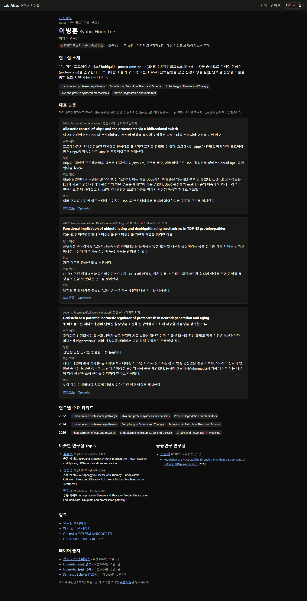
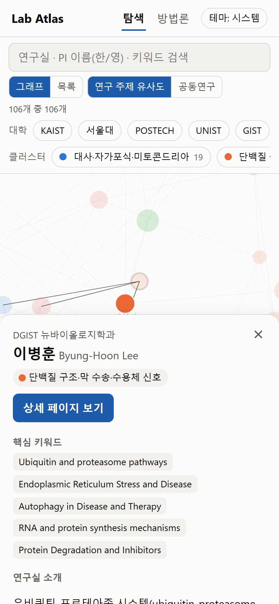

# Lab Atlas · 연구실 지형도

**🔗 라이브 사이트: https://kdwtom.github.io/lab-atlas/**

국내 6개 생명과학 학과의 연구실 **106곳**을 최근 5년 논문 내용으로 배치한 인터랙티브 지도입니다.
대학원 진학을 고민하는 학생이 "내가 관심 있는 연구와 비슷한 연구실은 어디에 있나"를 한눈에 탐색하고 비교할 수 있도록 만들었습니다.

- 노드 하나 = 연구실 하나. 색은 연구 주제 클러스터, 크기는 최근 5년 논문 수(로그)
- 선은 **연구 주제 유사도**(논문 임베딩) 또는 **공동연구**(함께 쓴 논문) 중 하나로 전환
- 연구실마다 대표 논문 3편의 한국어 요약, 연도별 키워드 변화, 비슷한 연구실 Top 5, 출처와 수집 날짜
- 모든 데이터는 공식 교수진 페이지와 OpenAlex·Semantic Scholar API 응답에서만 가져왔고, 확인할 수 없는 항목은 "정보 없음"으로 표시합니다

| 메인 그래프 | 호버 미리보기 |
|---|---|
|  |  |

| 연구실 상세 | 모바일 하단 시트 |
|---|---|
|  |  |

목록 보기, 방법론 페이지, 더미 300노드 성능 테스트 화면은 [docs/screenshots/](docs/screenshots/)에 있습니다.

---

## 범위와 데이터

| 학과 | 교수진 등재 | 전임 | OpenAlex 매칭 | 기준 충족 |
|---|---:|---:|---:|---:|
| KAIST 생명과학과 | 39 | 39 | 30 | 21 |
| 서울대학교 생명과학부 | 50 | 50 | 47 | 37 |
| POSTECH 생명과학과 | 29 | 29 | 24 | 16 |
| UNIST 생명과학과 | 18 | 18 | 14 | 11 |
| GIST 생명과학과 | 21 | 21 | 18 | 12 |
| DGIST 뉴바이올로지학과 | 23 | 21 | 18 | 9 |
| **합계** | **180** | **178** | **151** | **106** |

- **선정 기준**: 교수진 페이지에 현재 전임교원으로 등재 + 2022–2026년 마지막 저자 또는 교신저자 논문(article·review) 5편 이상
- **결과**: 연구실 106곳, 논문 1,630편, 유사도 연결선 280개, 공동연구 연결선 164개, 클러스터 9개
- **제외 기록**: 매칭에 실패했거나 기준에 못 미친 교수는 이름·대학·사유·후보 ID와 함께 [pipeline/output/excluded.csv](pipeline/output/excluded.csv)에 남깁니다(사유별 집계는 [stats.md](pipeline/output/stats.md))
- **검증**: 무작위 연구실 10곳을 실시간 출처와 대조한 결과는 [docs/verification.md](docs/verification.md) — 소속, OpenAlex 저자, 대표 논문, 논문 수, 링크 모두 10/10 일치

방법론 전체(매칭, 동명이인 처리, 유사도·클러스터링, 대표 논문 선정 규칙, 한계)는 사이트의 **방법론** 페이지(`#/about`)와 [PLAN.md](PLAN.md)에 있습니다.

---

## 실행 방법

필요: Python 3.11+, Node.js 20+. Windows PowerShell 기준이며 `make`는 쓰지 않습니다.

### 사이트만 실행 (데이터는 저장소에 포함)

```powershell
cd web
npm install
npm run dev          # http://localhost:5173
npm run typecheck
npm run build        # 정적 빌드 → web/dist
```

### 검증 (6단계)

```powershell
.\.venv\Scripts\Activate.ps1
python -m pytest pipeline/tests
python -m pipeline.run --stage verify     # 스키마 검증 → 빈 필드 통계 → 깨진 링크 검사 → 무작위 10곳 대조
#   결과: pipeline/output/field_stats.md, pipeline/output/link_report.csv, docs/verification.md
#   링크 검사와 대조는 캐시 없이 실시간으로 요청합니다

cd web
npm run build; npx vite preview --port 4173   # 다른 터미널에서
node scripts/check.mjs                        # 스크린샷(docs/screenshots) + 호버 FPS(실데이터 / 더미 300노드)
```

### 데이터 갱신 (파이프라인 재실행)

```powershell
py -3 -m venv .venv; .\.venv\Scripts\Activate.ps1
pip install -r pipeline\requirements.txt -r pipeline\requirements-ml.txt
copy .env.example .env                     # OPENALEX_MAILTO(필수), OPENALEX_API_KEY·S2_API_KEY(선택)

python -m pipeline.run --stage collect     # 교수진 → OpenAlex 매칭 → 논문 → TLDR → 통계 → 검증
python -m pipeline.run --steps flag        # 동명이인 의심 논문 → output/paper_flags.csv
#   사람이 검토해 제외할 논문을 pipeline/curation/excluded_papers.csv에 사유와 함께 기록한 뒤
python -m pipeline.run --steps papers,tldr,stats
python -m pipeline.run --stage analyze     # SPECTER 임베딩 → 유사도·공동연구·Louvain·UMAP → 검증
python -m pipeline.run --stage export      # 대표 논문 선정 → web/public/data 내보내기 → 검증
```

- 모든 HTTP 응답은 `pipeline/cache/`에 캐시되어 재실행 시 네트워크를 다시 쓰지 않습니다. `--offline`으로 캐시만 사용할 수 있습니다
- 클러스터 라벨은 [pipeline/curation/cluster_labels.json](pipeline/curation/cluster_labels.json)에서 관리하며, 클러스터 키워드가 바뀌면 경고가 나옵니다
- 한국어 요약과 연구실 소개는 `export`가 만든 `pipeline/output/summary_tasks/batch_NN.md`(초록·TLDR)를 근거로 작성해 `pipeline/curation/summaries/batch_NN.json`에 저장합니다. 요약이 없으면 사이트에 "정보 없음"으로 나옵니다
- 갱신한 `web/public/data`를 커밋하고 push하면 GitHub Actions가 배포합니다

### 배포 (GitHub Pages)

[.github/workflows/deploy.yml](.github/workflows/deploy.yml)이 `main` push마다 데이터 스키마 검증 → 타입 검사 → 빌드 → Pages 배포를 실행합니다.
처음 한 번 저장소의 **Settings → Pages → Source**를 "GitHub Actions"로 바꿔 주세요. 방법론 페이지의 "정보 수정 요청" 링크는 빌드 시 저장소 주소(`VITE_REPO_URL`)로 자동 설정됩니다.

---

## 기술적 의사결정

| 결정 | 이유 |
|---|---|
| **정적 사이트 + 빌드 시 고정 JSON** | 런타임 API 호출이 없어 GitHub Pages에서 무료로 호스팅되고, API 한도·장애와 무관하게 동작합니다. 모든 레코드에 출처 URL과 수집 날짜가 남습니다 |
| **HashRouter**, Vite `base: './'` | GitHub Pages는 SPA 라우팅 fallback이 없으므로 `#/lab/:id` 형태로 새로고침·공유 링크가 깨지지 않게 했습니다 |
| **OpenAlex** (Scopus·Google Scholar 대신) | 무료·개방 API, 저자 ID·소속 이력·ORCID·교신저자 여부·주제를 모두 제공해 동명이인 교차 확인이 가능합니다 |
| **엄격한 매칭 후 제외** | 잘못 매칭된 연구실 하나가 사이트 신뢰도를 크게 떨어뜨리므로, 소속 이력·이름 표기·주제·교수진 페이지 대표 논문·ORCID를 교차 확인해 후보가 정확히 한 명일 때만 매칭하고 나머지는 사유와 함께 제외했습니다 |
| **동명이인 논문 2단계 정리** | OpenAlex 병합 프로필에 타인의 논문이 섞이는 문제를 (1) 소속 필터, (2) 임베딩 이상치 표시 + 사람 검토로 처리했습니다. 무작위 대조에서 논문 수가 정확히 재현됩니다 |
| **SPECTER 임베딩 + 인용 로그 가중 평균** | 과학 논문 제목·초록에 특화된 모델이라 키워드 일치보다 연구 내용 유사도를 잘 반영하고, CPU에서 돌아갑니다. 인용 가중치는 연구실의 대표 방향을 강조하되 log로 소수 논문의 과도한 영향을 막습니다 |
| **상위 k=5 이웃 + 분위수 임계값** | 모든 쌍을 연결하면 그래프가 털뭉치가 되므로, 연구실마다 가까운 이웃만 남기고 하위 25%는 잘라 선의 의미를 유지했습니다 |
| **Louvain(seed 고정) + UMAP 초기 좌표** | 재실행해도 같은 클러스터·같은 모양이 나오도록 seed를 고정했고, UMAP 좌표를 앵커로 쓰는 약한 힘 덕분에 레이아웃이 매번 같은 지형으로 수렴합니다 |
| **react-force-graph-2d (Canvas)** | SVG보다 노드 수백 개에서 호버가 가볍습니다. 실데이터와 더미 300노드 모두 호버 중 약 59fps를 확인했습니다 |
| **초록 원문 비공개** | 저작권을 고려해 사이트에는 직접 작성한 요약과 DOI 링크만 싣습니다. 검증 단계가 공개 데이터에 `abstract`·`tldr`·이메일이 없는지 검사합니다 |
| **pydantic ↔ TypeScript 1:1 스키마** | 파이프라인의 마지막 단계와 CI에서 스키마·상호 참조를 검증해 프론트엔드가 잘못된 데이터를 받지 않게 했습니다 |
| **접근성** | 그래프는 마우스 전용이므로 키보드로 쓸 수 있는 검색(콤보박스)과 정렬 가능한 목록 표를 함께 제공하고, 텍스트 색 대비는 라이트·다크 모두 WCAG AA(4.5:1 이상)를 충족합니다. 클러스터는 색과 함께 항상 글자 라벨로도 표시합니다 |

---

## 폴더 구조

```
lab-atlas/
├─ pipeline/                 # Python 데이터 파이프라인 (python -m pipeline.run)
│  ├─ step01…step10_*.py     # 수집 → 매칭 → 논문 → TLDR → 통계 → 임베딩 → 분석 → 선정 → 내보내기
│  ├─ validate.py            # pydantic 스키마·상호 참조·공개 규칙 검증
│  ├─ field_stats.py         # 빈 필드 통계
│  ├─ check_links.py         # 깨진 링크 검사 (실시간)
│  ├─ spot_check.py          # 무작위 연구실 출처 대조 (실시간)
│  ├─ curation/              # 사람이 검토·작성한 입력: 제외 논문, 클러스터 라벨, 요약
│  └─ output/                # 중간 산출물, excluded.csv, 통계
├─ web/                      # Vite + React + TypeScript
│  ├─ public/data/           # labs / papers / edges / clusters / meta .json
│  ├─ src/                   # 그래프, 패널, 목록, 상세·방법론 페이지
│  └─ scripts/check.mjs      # 스크린샷 + 성능 측정 (로컬 Edge, playwright-core)
├─ docs/                     # 스크린샷, 출처 대조 결과
└─ .github/workflows/        # GitHub Pages 배포
```

## 한계

- **요약이 일부 비어 있고, 그 공백이 한쪽에 몰려 있습니다**: 대표 논문 한국어 요약은 311편 중 263편, 연구실 소개는 106곳 중 90곳이 작성되어 있습니다. 남은 공백은 무작위가 아니라 **UNIST 11곳 전부와 서울대 5곳**으로, 요약을 연구실 ID 순서대로 작성하다 중단했기 때문입니다. 요약이 없다고 해서 그 연구실의 연구 성과가 적다는 뜻이 아니므로, 방법론 페이지와 각 연구실 상세 페이지에 이 사실을 명시했습니다(현황은 데이터에서 자동 계산되어 남은 요약을 채우면 문구가 사라집니다)
- 요약과 연구실 소개는 AI 언어 모델(Claude)이 초록·TLDR만을 근거로 작성했고 표본을 원문과 대조해 점검했지만, 오류가 있을 수 있습니다
- OpenAlex의 저자 식별·교신저자 정보 오류가 그대로 반영될 수 있고, 매칭이 불확실한 교수는 지형도에서 빠져 있습니다(excluded.csv)
- "최근 5년 마지막/교신저자 5편" 기준은 신임 교수에게 불리합니다. 지형도에 없다는 것이 연구 활동이 적다는 뜻은 아닙니다
- 유사도·클러스터는 논문 텍스트 기반 근사치이며 연구실 분위기·모집 계획은 반영하지 않습니다

이 프로젝트는 각 대학·학과와 관계없는 개인 포트폴리오입니다. 교수 사진은 사용하지 않습니다.
